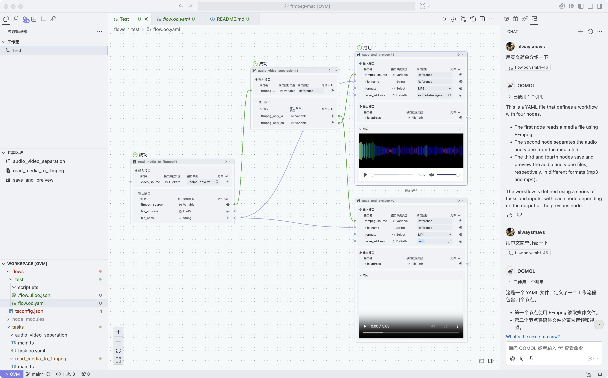

This is a workflow with four nodes. 

* The first node reads a media file using FFmpeg.
* The second node separates the audio and video from the media file.
* The third and fourth nodes save and preview the audio and video files, respectively, in different formats (mp3 and mp4). 

The workflow is defined using a series of tasks and inputs, with each node depending on the output of the previous node.